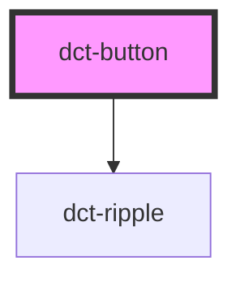

# dct-button

<!-- Auto Generated Below -->

## Overview

Button

Basic button component with optional ripple effect.

Work in progress!!

* They may display text or icons.

## Properties

| Property      | Attribute      | Description                                        | Type                                             | Default      |
| ------------- | -------------- | -------------------------------------------------- | ------------------------------------------------ | ------------ |
| `ariaLabel`   | `aria-label`   | Optional aria label for button                     | `string`                                         | `undefined`  |
| `buttonColor` | `button-color` | The Buttons's type. Default 'button'               | `"primary" \| "secondary"`                       | `'primary'`  |
| `buttonStyle` | `button-style` | The Buttons's type. Default 'button'               | `"elevated" \| "filled" \| "outlined" \| "text"` | `'outlined'` |
| `buttonType`  | `button-type`  | The Buttons's type. Default 'button'               | `"button" \| "reset" \| "submit"`                | `'button'`   |
| `disabled`    | `disabled`     | Button in an disabled state. Default false.        | `boolean`                                        | `false`      |
| `iconButton`  | `icon-button`  | Is button for display of icons only. Default false | `boolean`                                        | `false`      |
| `ripple`      | `ripple`       | Ripple effect enabled for button. Defult false     | `boolean`                                        | `false`      |

## Events

| Event            | Description          | Type                |
| ---------------- | -------------------- | ------------------- |
| `dctButtonClick` | Button event emitter | `CustomEvent<void>` |

## Slots

| Slot      | Description                       |
| --------- | --------------------------------- |
| `"end"`   | Container icon after title text   |
| `"slot"`  | Container for the button content  |
| `"start"` | Container icon before button text |

## CSS Custom Properties

| Name                           | Description            |
| ------------------------------ | ---------------------- |
| `--dct-accordion-background`   | accordion background   |
| `--dct-accordion-border-color` | accordion border color |
| `--dct-button-height`          | button height          |
| `--dct-button-width-icon`      | width of icon button   |

## Dependencies

### Depends on

- [dct-ripple](../ripple)

### Graph

----------------------------------------------

*Built with [StencilJS](https://stenciljs.com/)*
