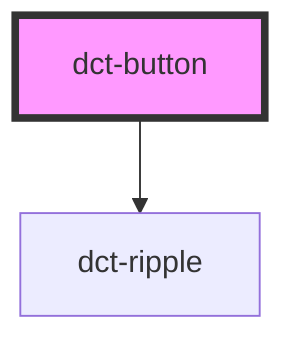

# dct-button

<!-- Auto Generated Below -->

## Overview

Button

Basic button component with optional ripple effect. They may display
text or icons.

## Properties

| Property      | Attribute      | Description                                                                                 | Type                                 | Default     |
| ------------- | -------------- | ------------------------------------------------------------------------------------------- | ------------------------------------ | ----------- |
| `ariaLabel`   | `aria-label`   | Optional aria label for button                                                              | `string`                             | `undefined` |
| `border`      | `border`       | The Buttons's border style. Solid, elevated or none. Default elevated, shadow style border. | `"elevated" \| "none" \| "outlined"` | `'none'`    |
| `buttonStyle` | `button-style` | The Buttons's type. Default 'button'                                                        | `"default" \| "icon"`                | `'default'` |
| `buttonType`  | `button-type`  | The Buttons's type. Default 'button'                                                        | `"button" \| "reset" \| "submit"`    | `'button'`  |
| `disabled`    | `disabled`     | Button in an disabled state. Default false.                                                 | `boolean`                            | `false`     |
| `ripple`      | `ripple`       | Ripple effect enabled for button. Defult true                                               | `boolean`                            | `true`      |

## Events

| Event            | Description          | Type                |
| ---------------- | -------------------- | ------------------- |
| `dctButtonClick` | Button event emitter | `CustomEvent<void>` |

## Slots

| Slot     | Description                      |
| -------- | -------------------------------- |
| `"slot"` | Container for the button content |

## CSS Custom Properties

| Name                  | Description   |
| --------------------- | ------------- |
| `--dct-button-height` | button height |

## Dependencies

### Depends on

- [dct-ripple](../ripple)

### Graph

----------------------------------------------

*Built with [StencilJS](https://stenciljs.com/)*
