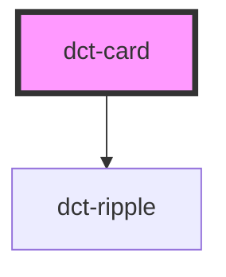

# dct-card

<!-- Auto Generated Below -->

## Overview

Card
Display content and actions about a single subject. Card contents can include anything 
from images to headlines, supporting text, buttons, and lists

Cards and created from title, subtitle and content elements and have been broken into
multiple components to support this structure.

## Properties

| Property   | Attribute  | Description                                                                                                         | Type                                 | Default      |
| ---------- | ---------- | ------------------------------------------------------------------------------------------------------------------- | ------------------------------------ | ------------ |
| `border`   | `border`   | The Card's border style. Solid, elevated or none. Default elevated, shadow style border.                            | `"elevated" \| "none" \| "outlined"` | `'elevated'` |
| `disabled` | `disabled` | Card is in a disabled state. Setting this state will also set the disabled property of any child components         | `boolean`                            | `false`      |
| `href`     | `href`     | Contains a URL or URL fragment. If this property is set, card an anchor tag will be rendered                        | `string`                             | `undefined`  |
| `ripple`   | `ripple`   | Ripple effect enabled for card. Defult true                                                                         | `boolean`                            | `true`       |
| `target`   | `target`   | Applies when a href value is provided. It contains the target value to display the linked URL Default value _blank; | `string`                             | `'_blank'`   |

## Slots

| Slot     | Description                                |
| -------- | ------------------------------------------ |
| `"slot"` | Container for the Card's title and content |

## Dependencies

### Depends on

- [dct-ripple](../ripple)

### Graph

----------------------------------------------

*Built with [StencilJS](https://stenciljs.com/)*
