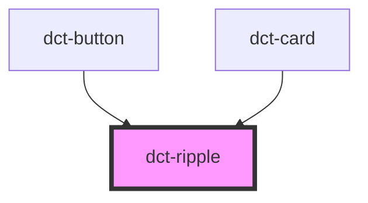

# dct-ripple

<!-- Auto Generated Below -->

## Properties

| Property    | Attribute   | Description | Type      | Default |
| ----------- | ----------- | ----------- | --------- | ------- |
| `unbounded` | `unbounded` |             | `boolean` | `false` |

## Methods

### `addRipple(ev: Event) => Promise<() => void>`

#### Returns

Type: `Promise<() => void>`

## Dependencies

### Used by

 - [dct-button](../button)
 - [dct-card](../card)

### Graph

----------------------------------------------

*Built with [StencilJS](https://stenciljs.com/)*
